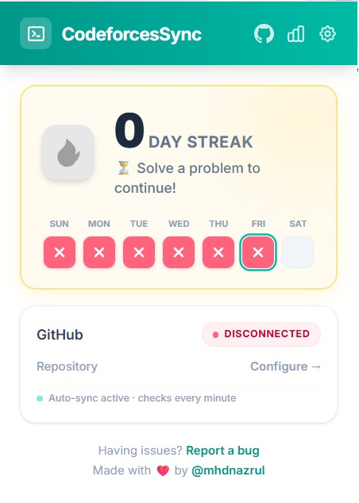
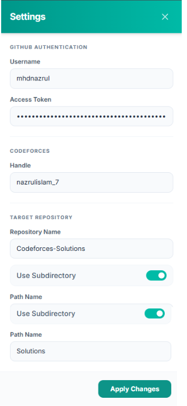
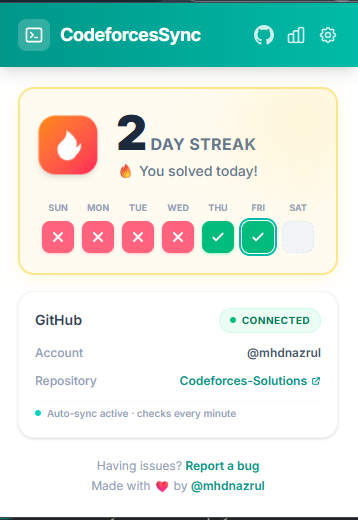

<div align="center">
  
  <h1>CodeforcesSync 🚀</h1>
  <p><strong>Automatically sync your accepted Codeforces solutions to GitHub in real-time.</strong></p>

  <p>
    <a href="https://github.com/mhdnazrul/CodeforcesSync/stargazers"></a>
    <a href="https://github.com/mhdnazrul/CodeforcesSync/network/members"></a>
    <a href="https://github.com/mhdnazrul/CodeforcesSync/pulls"></a>
    <a href="https://github.com/mhdnazrul/CodeforcesSync/issues"></a>
    <a href="https://opensource.org/licenses/MIT"></a>
  </p>
</div>

<hr />

## 📑 Table of Contents
- [About The Project](#-about-the-project)
- [Screenshots](#-screenshots)
- [Features](#-features)
- [Tech Stack](#-tech-stack)
- [How It Works](#-how-it-works)
- [Installation](#-installation)
- [Configuration](#-configuration)
- [Usage](#-usage)
- [Project Structure](#-project-structure)
- [Future Improvements](#-future-improvements)
- [Contributing](#-contributing)
- [License](#-license)

## 📌 About The Project

**CodeforcesSync** is a powerful Chrome Extension designed for competitive programmers. It seamlessly bridges your Codeforces journey with your GitHub profile. 

Whenever you receive an **"Accepted"** verdict on Codeforces, this extension automatically detects the submission, extracts your source code, and directly pushes it to a chosen GitHub repository. It works entirely in the background using the official GitHub API, ensuring your coding profile stays up to date without any manual effort.

## 📸 Screenshots

| Disconnected State | Settings Configuration | Connected State |
| :---: | :---: | :---: |
|  |  |  |

## ✨ Features

- ⚡ **Automated Background Syncing**: No manual copying or committing required. If you solve it, it syncs.
- 🔥 **Real-time Streak Tracking**: Gamify your daily progress with an integrated solving streak tracker right inside the visual popup!
- 🧠 **Smart Language Detection**: Parses exact language tags (e.g., `GNU C++20`, `PyPy 3`) and maps them to accurate file extensions (`.cpp`, `.py`, `.js`, etc.).
- 🛡️ **Cloudflare Bot Bypass**: Intelligently utilizes your active Codeforces tab session to safely fetch code without triggering aggressive Cloudflare blockages.
- 📁 **Custom Subdirectories**: Store submissions in a specific folder (like `solutions/`) by configuring custom repository paths natively from the popup.
- ⏱️ **Smart API Throttling**: Safely manages GitHub Secondary Rate limits and Codeforces API limits behind the scenes using asynchronous delays.

## 🛠 Tech Stack

CodeforcesSync is built with modern web technologies:

- **React 19** - Powerful User Interface layout
- **TypeScript** - Type-safe programming
- **Tailwind CSS v4** - Beautiful responsive styling
- **Vite** - Lightning-fast frontend build tool
- **Chrome Extension API (Manifest V3)** - Core extension functionality
- **GitHub REST API** - Uploading files and committing code natively

## ⚙️ How It Works

1. **Polling**: The Service Worker (`background.ts`) relies on Chrome Alarms to silently poll the official Codeforces API (`user.status`) every minute.
2. **Filtering**: It filters your recent submissions to find new **Accepted (OK)** verdicts that haven't been previously synced.
3. **Fetching Code**: Instead of a basic `fetch` (which Cloudflare blocks), the extension securely injects a fetch execution script into your currently open Codeforces tab to safely extract the raw source code.
4. **Pushing to GitHub**: The code is encoded in Base64 and automatically committed to your linked GitHub repository via the GitHub REST API.

---

## 🚀 Quick Start / Installation

CodeforcesSync is distributed via source and Developer Mode in Chrome.

### 1. Download the Extension
Download the latest **Pre-built Release** ZIP file from the [Releases page](https://github.com/mhdnazrul/CodeforcesSync/releases) or build it manually from source. #[**Best Oprtion**]

**To build from source:**
```bash
# Clone the repository
git clone https://github.com/mhdnazrul/CodeforcesSync.git

# Navigate into the project
cd CodeforcesSync

# Install dependencies
npm install

# Build the extension
npm run build
```
This generates a production-ready `dist/` folder containing the compiled Chrome Extension.

### 2. Load into Chrome
1. Open Google Chrome and navigate to: `chrome://extensions/`
2. Turn on **Developer mode** using the toggle switch in the top right corner.
3. Click the **Load unpacked** button in the top left corner.
4. Select the `dist` folder located inside your project directory (or the extracted `dist` folder from the Release ZIP).
5. The extension is now installed! *(Optional: Pin it to your toolbar for easy access.)*

---

## 🔧 Configuration

To allow the extension to securely push code on your behalf, you need a standard GitHub Personal Access Token (PAT).

### Step 1: Create a GitHub Repository
Create a new Public or Private repository on GitHub (e.g., `Codeforces-Solutions`).

### Step 2: Generate a Personal Access Token
1. Go to **GitHub → Settings → Developer settings → Personal Access Tokens → Tokens (classic/fine-grained)**
2. Click **Generate new token → Fine-grained token**.
3. set **name** and **date** (e.g., `30 day` or `90 days`)
4. **Repository access: Select repositories → (e.g., `Codeforces-Solutions`)
5. **Permissions:**
**Contents** → `Read & Write` <br>
**Commit statuses** → `Read & Write` (optional)
6. Click **Generate token** and **COPY it immediately** → **update your extension** with it.

### Step 3: Link the Extension
1. Click the **CodeforcesSync icon** in your Chrome toolbar.
2. Click the **Settings** gear icon.
3. Fill in your details:
   - **GitHub Username**
   - **Personal Access Token**
   - **Codeforces Handle** (e.g., `tourist`)
   - **Repo Name** (e.g., `Codeforces-Solutions`)
   - *(Optional)* Check **Use Subdirectory** and enter a folder name.
4. Click **Save**.

---

## 🕹️ Usage

Once configured, the background service takes over!

1. **Keep Codeforces Active**: You must leave a Codeforces tab completely open in your browser while solving. The extension securely borrows your active Codeforces session to bypass Cloudflare Bot-Protection blockages.
2. **Solve Problems**: Submit solutions as normally as you would!
3. **Automatic Syncing**: Once receiving an **"Accepted"** verdict, CodeforcesSync intercepts the submission, processes the source code locally, and pushes it up to your linked repository.

---

## 📁 Project Structure

```text
CodeforcesSync/
├── public/                 # Static extension assets (icons, manifest)
├── src/                    # Source code
│   ├── background/         # Background Service Worker logic (API polling)
│   ├── utils/              # Helper functions (storage, GitHub API mapping)
│   ├── App.tsx             # Main React UI for the Extension Popup
│   ├── main.tsx            # React entry point
│   └── index.css           # Tailwind CSS styles
├── package.json            # Node.js dependencies and scripts
└── vite.config.ts          # Vite bundler configuration
```

## 🔮 Future Improvements

- [ ] Add support for syncing submissions from other platforms (LeetCode, AtCoder, CodeChef).
- [ ] Allow customizable commit messages.
- [ ] Create an explicit "Sync Now" button in the popup to force an immediate refresh.
- [ ] Implement a rich dashboard showing solving statistics and language summaries.
- [ ] Submit to Chrome Web Store for easier access.

## 🤝 Contributing

Contributions are what make the open source community such an amazing place to learn, inspire, and create. Any contributions you make are **greatly appreciated**.

> **Important Note for Developers:** Ensure you keep a Codeforces tab open while testing, as the extension relies on active tab sessions to bypass Cloudflare protection!

1. Fork the Project.
2. Create your Feature Branch (`git checkout -b feature/AmazingFeature`).
3. Commit your Changes (`git commit -m 'Add some AmazingFeature'`).
4. Push to the Branch (`git push origin feature/AmazingFeature`).
5. Open a Pull Request.

## 🚑 Troubleshooting

**Code is not syncing?**
* **Cloudflare Blocking:** DevTools might say "Blocked by Cloudflare Error". Ensure you keep the actual `codeforces.com` website actively open in your browser. Without a valid tab session, Codeforces treats the background worker as a web scraper bot!
* **Missing Handle:** Double-check that your Codeforces handle in the extension settings matches exactly with your profile.

## 📄 License

Distributed under the MIT License. See `LICENSE` for more information.

---

<div align="center">
  <h3><b>Codeforces to GitHub Auto-Sync</b></h3>
  <p>Made with ❤️ by <b>Nazrul</b></p>
  
  <a href="https://github.com/mhdnazrul">
    
  </a>
  <a href="mailto:mhdnazrul511@gmail.com">
    
  </a>
  
  <br>
  <p>If you like this extension, please consider giving it a ⭐!</p>
</div>
